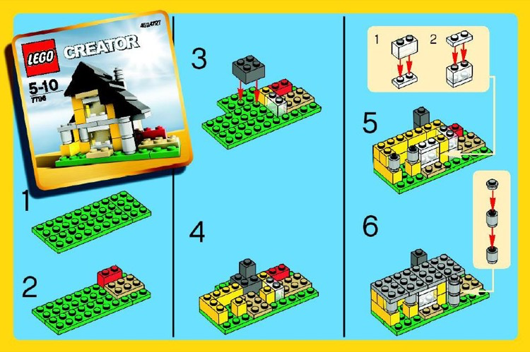

# Overview
I initially assumed tokens and tickets might be the same thing, but during class I realized they are completely different. A token is how AI processes language, while a ticket is how people track work.

## Token
A token is a small piece of text that an AI model reads or writes. I think of tokens like Lego pieces. The AI breaks a sentence into smaller chunks before processing it.
- "I" ➡︎ token
- " want" ➡︎ token
- " to" ➡︎ token
- " build" ➡︎ token
- " a" ➡︎ token
- " house" ➡︎ token
- chunk = token

Tokens matter because AI systems use them to understand prompts, generate responses, and decide how much information can fit in the model’s context window.

## Tickets
A ticket is different because it is used for work tracking. In tools like GitHub Issues, a ticket can represent a bug, feature, AI issue, or improvement.
### Example ticket

- Title: Chatbot gave incorrect instructions for building a house.
- Description: The AI incorrectly flagged a compliant item as a dog barking issue 🐶 and needs to be reviewed.

This is where people like me come in. Humans still need to review, test, and improve AI systems so errors do not keep happening.

## My Takeaways
- Tokens are how the AI processes the language.
- Tickets is how teams like myself track work.