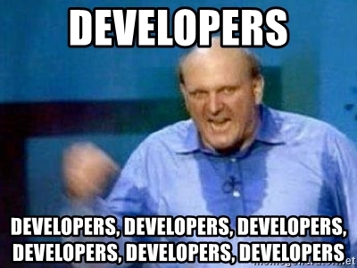
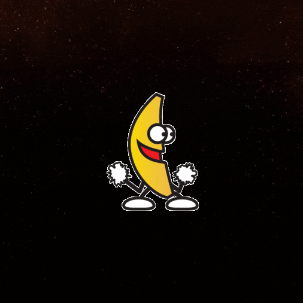
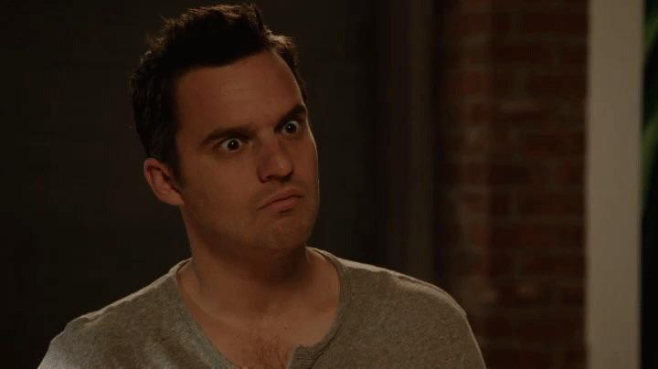
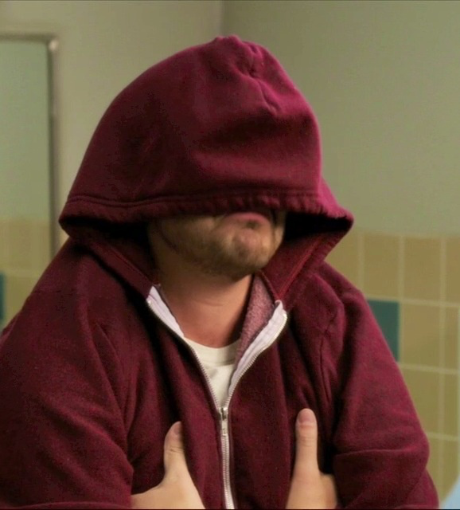

# Randy Pausch Last Lecture Reflection

I would like to start this with these images first to express my feelings while watching this video. 

## My Reflection

Randy Pausch’s time management strategy, highlighting the intended use of our limited time, resonated with me. He viewed time as something to protect, organize, and spend wisely, rather than letting it stagnate. This view is especially applicable in computer science, where competing demands can quickly become overwhelming. His message explained how prioritizing is more important than simply staying busy.

Pausch’s VR projects were also examples of head fakes. At first, it looked like students were just making interesting graphics and unusual virtual worlds. But actually, they were learning important computer science skills like problem solving, working in teams, being creative with limits, and turning ideas into real projects.

The “head fake” concept also made a strong impression on me. In computer science coursework, the apparent objective may be to complete a project or pass a class, but the underlying goal is to develop critical thinking, problem-solving, communication, and perseverance. For instance, while a group project may seem focused on software development, it is about how effective teamwork, managing vagueness, and collaborating with various personalities.

Pausch’s lecture showed that big lessons are often hidden in the work itself. In computer science, assignments aren’t just about learning technical skills. They also teach us how to think, adapt, and keep going.